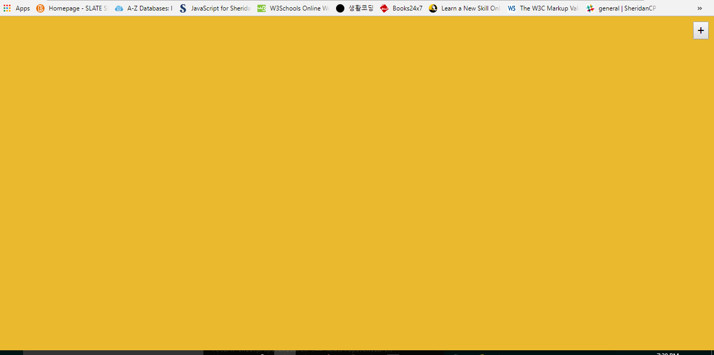

# [Web Sticky Note]
  - This application is created by using React.js.
  - The goal of this project is to practice React.js I learned from Lynda.com.

# [Programming Summary]
## The purpose of this project is to practice Babel, JSX, ES6, and JSON in a while of realizing this application.
### - Utilized two ES6 components, JSON syntax, and JavaScriptDOM/ReactDOM
### - Used Event, State, Ref. Value, Update and Remove nodes, and so on.
### - To move sticker note, deployed the 'draggable component.
##### 
######
